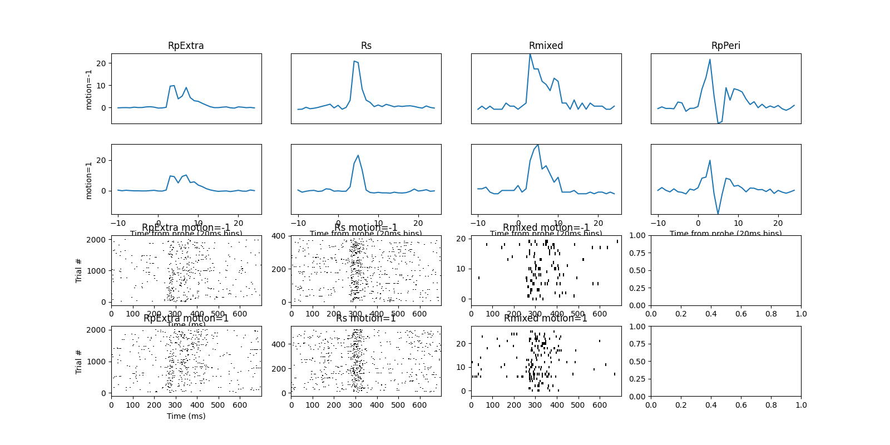
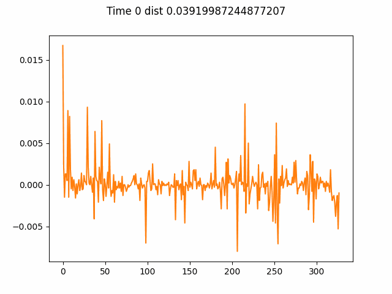
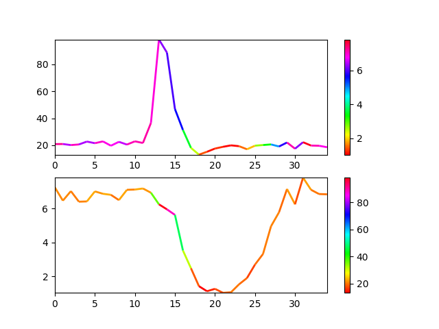
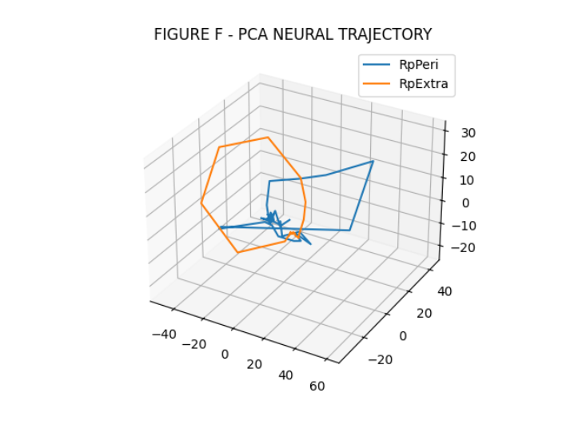
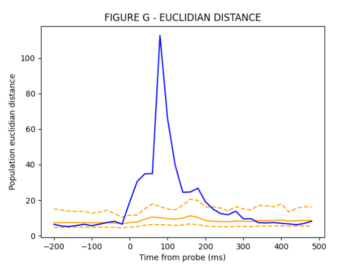
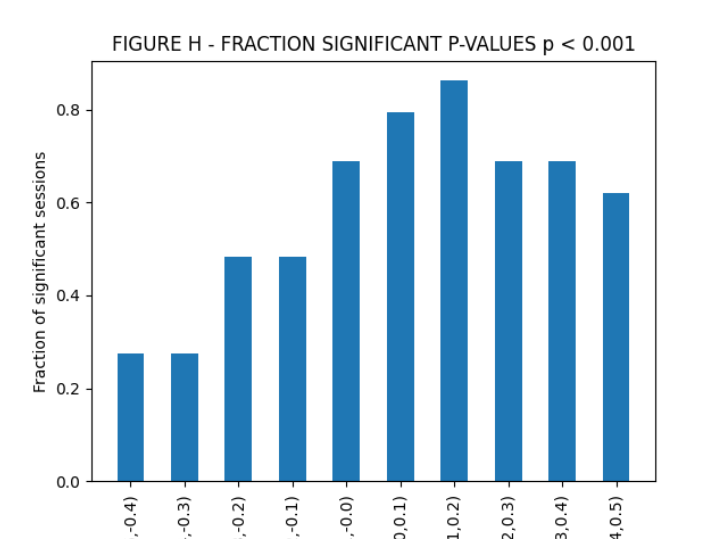
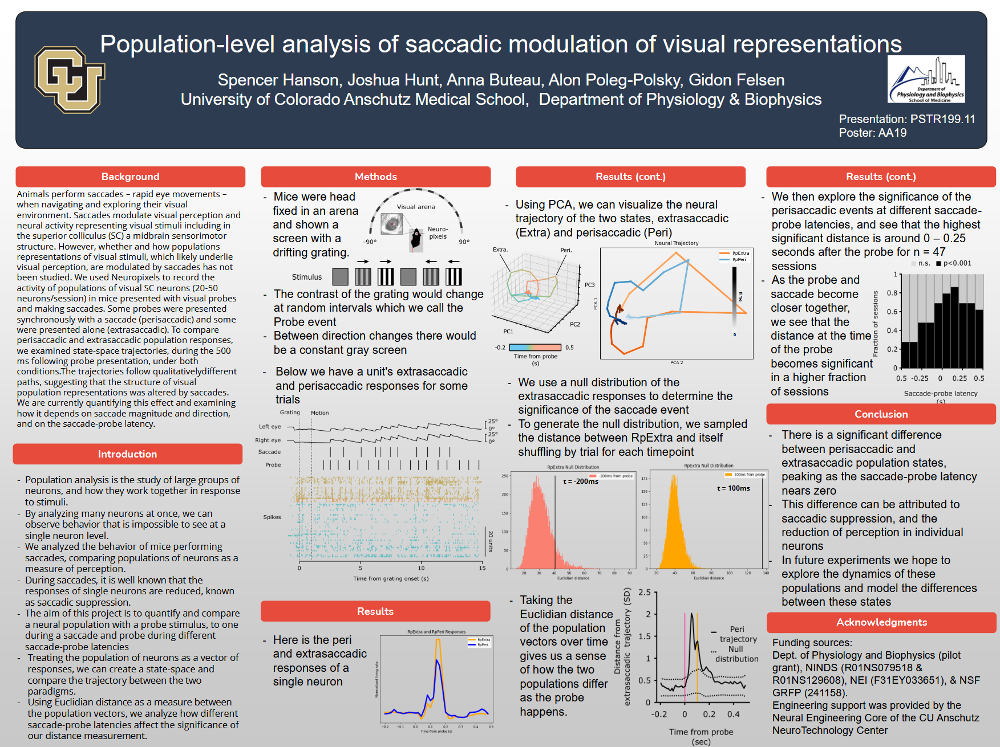

# Saccade Population Analysis

Code for population analysis in the paper: https://www.biorxiv.org/content/10.1101/2024.09.21.613770v1.full

Data in progress to be published online (at some point)


#### Background
```
Animals perform saccades – rapid eye movements –
when navigating and exploring their visual
environment. Saccades modulate visual perception and
neural activity representing visual stimuli including in
the superior colliculus (SC) a midbrain sensorimotor
structure. However, whether and how populations
representations of visual stimuli, which likely underlie
visual perception, are modulated by saccades has not
been studied. We used Neuropixels to record the
activity of populations of visual SC neurons (20-50
neurons/session) in mice presented with visual probes
and making saccades. Some probes were presented
synchronously with a saccade (perisaccadic) and some
were presented alone (extrasaccadic). To compare
perisaccadic and extrasaccadic population responses,
we examined state-space trajectories, during the 500
ms following probe presentation, under both
conditions.The trajectories follow qualitativelydifferent
paths, suggesting that the structure of visual
population representations was altered by saccades.
We are currently quantifying this effect and examining
how it depends on saccade magnitude and direction,
and on the saccade-probe latency.
```
#### Some graphs

- A single unit (neuron) in terms of firing rates and spikes, trial averaged




- Distance weights visualized over time for a population





- Neural trajectory in PCA space for different units


- Two units firing rates, compared





- Figure F, PCA neural trajectory of a population





- Figure G, Euclidian distance of a population compared to a baseline of no stimulus





- Figure H, the fraction of sessions with p-value < 0.001 for different saccade-probe latencies





- 3d PCA Neural trajectory with distance weights for a population comparison 


### Society for Neuroscience 2024 Poster

